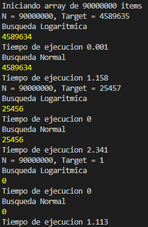

# Desafío para Software Engineers

Nombre postulante: [Richard de Jesus Martinez Shildes]
Link a la app en producción: [https://whatcountry.vercel.app/]

## Respuesta A LA pregunta

### Pregunta
"La tabla que contiene la información correspondiente a la asistencia diaria de un niño en un colegio tiene 90 millones de filas. Todas las tablas del sistema existen en la misma BDD en MySQL. La lógica del backend que actualiza la información correspondiente al pasar la asistencia tiene un tiempo de servicio p95 de 10 segundos. El equipo está interesado en bajar este tiempo para mejorar la experiencia del usuario (y porque nos gusta pensar en Kimche como un Ferrari). ¿Qué propondrías para enfrentar el problema? Esta pregunta es abierta, no hay respuestas malas. Puedes proponer arquitectura, tecnologías, diseño, etc."

### Respuesta

#### BUSQUESA BINARIA

`//Tiempo de ejecucion logaritmico`
`//Condiciones`
`// Tener al menos un campo con un orden secuencial establecido por ejemplo 1n+1`
`//Ventajas`
`// Velocidad al momento de conseguir informacion en objetos muy grandes.`
`// El tiempo de respuesta sera similar para cualquier busquedas.`
`//Desventajas`
`// Tardara aproximadamente el mismo tiempo en retornar informacion de los  primeros `resoltados tanto como los ultimos resultados.
`//Secuencia.`
`// Estableciendo N = 90.000.000 siendo la secuencia de id 1n+1`
`// Y el target T = 4.589.635`
`// I el numero de iteracion`
`// N/2 < target`
`//     N = N/2 ..... N => Repite la secuencia`
`// N/2 > target`
`//     N = 0 ......N/2 => Repite la secuencia`
`// N=target`
`//     devuelve la inforamcion del target.`
`//`
`//`
`//let medirTiempo = (cv) => {`
`//  let timeStart;`
`//  let timeEnd;`
`//  timeStart = Date.now();`
`//  cv();`
`//  timeEnd = Date.now();`
`//  console.log(`Tiempo de ejecucion ${(timeEnd - timeStart) / 1000}`);`
`//};`
`//let algoritmoDeBusquedaRecursivo = ({ iterableArr, from, to, target }) => {`
`//  if (to >= from) {`
`//    let medio = from + parseInt((to - from) / 2);`
`//    if (iterableArr[medio] === target) return medio;`
`//    if (iterableArr[medio] > target) {`
`//      return algoritmoDeBusquedaRecursivo({`
`//        iterableArr,`
`//        from,`
`//        to: medio - 1,`
`//        target,`
`//      });`
`//    }`
`//    return algoritmoDeBusquedaRecursivo({`
`//      iterableArr,`
`//      from: medio + 1,`
`//      to,`
`//      target,`
`//    });`
`//  }`
`//  return -1;`
`//};`
`//let testDeBusqueda = (T, arr) => {`
`//  let arrSize = arr.length;`
`//  let result = algoritmoDeBusquedaRecursivo({`
`//    iterableArr: arr,`
`//    from: 0,`
`//    to: arrSize - 1,`
`//    target: T,`
`//  });`
`//`
`//  if (result === -1) return -1;`
`//  else return result;`
`//};`
`//let busquedaNormal = (T, arr) => {`
`//  let item;`
`//  arr.forEach((el, i) => {`
`//    if (el === T) item = i;`
`//  });`
`//  return item;`
`//};`
`//`
`//let arr = [];`
`//let N = 90000000;`
`//let T = 4589635;`
`//`
`//console.log(`Iniciando array de ${N} items`);`
`//for (let i = 1; i <= N; i++) arr.push(i);`
`//console.log(`N = ${N}, Target = ${T}`);`
`//console.log("Busqueda Logaritmica");`
`//medirTiempo(() => console.log(testDeBusqueda(T, arr)));`
`//console.log("Busqueda Normal");`
`//medirTiempo(() => console.log(busquedaNormal(T, arr)));`
`//T = 25457;`
`//console.log(`N = ${N}, Target = ${T}`);`
`//console.log("Busqueda Logaritmica");`
`//medirTiempo(() => console.log(testDeBusqueda(T, arr)));`
`//console.log("Busqueda Normal");`
`//medirTiempo(() => console.log(busquedaNormal(T, arr)));`
`//T = 1;`
`//console.log(`N = ${N}, Target = ${T}`);`
`//console.log("Busqueda Logaritmica");`
`//medirTiempo(() => console.log(testDeBusqueda(T, arr)));`
`//console.log("Busqueda Normal");`
`//medirTiempo(() => console.log(busquedaNormal(T, arr)));`
`//`
## Imagen comparativa de eficiencia.

